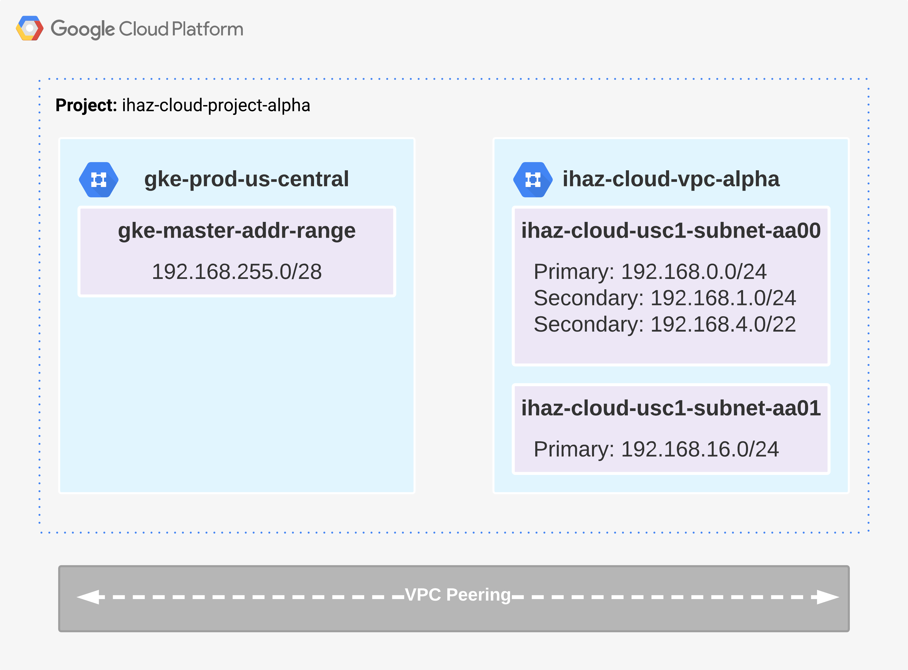
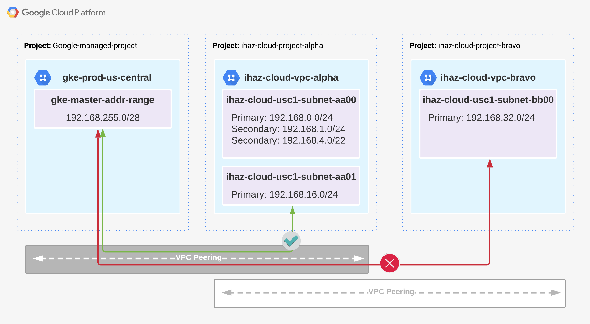
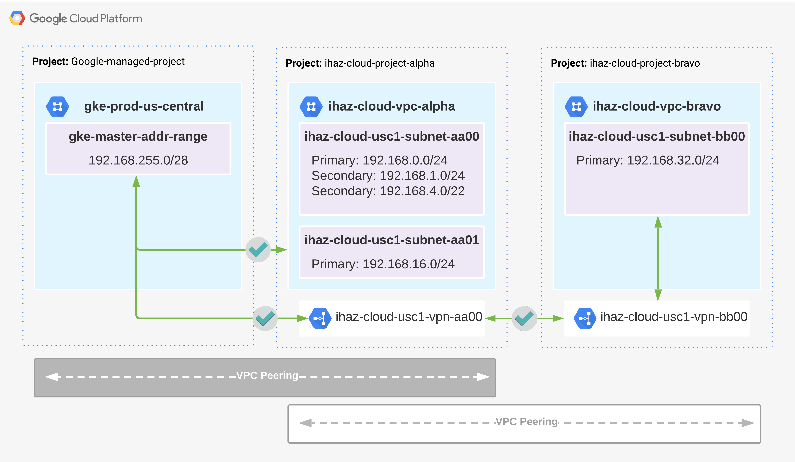
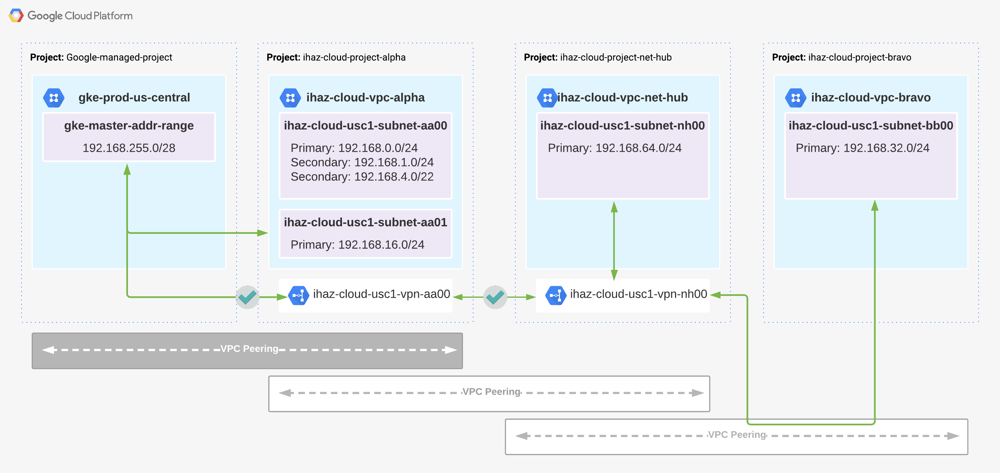

# Challenge
Users are not able to connect to private clusters and manage services such as GKE or Cloud-SQL from a when traversing through peer VPC and the service does not have an exposed public address.

# Root Cause
Some services establish vpc peering between Google managed infrastructure and your VPC when they are deployed
- Services that establish a VPC Peer
    - GKE Private Clusters (https://cloud.google.com/kubernetes-engine/docs/concepts/private-cluster-concept)
    - Private Services access for Cloud SQL (https://cloud.google.com/sql/docs/mysql/configure-private-services-access#configure-access)
    - Private IP Cloud Composer (https://cloud.google.com/composer/docs/how-to/managing/configuring-private-ip)



Only directly peered networks can communicate. Transitive peering is not supported. In other words, if VPC network N1 is peered with N2 and N3, but N2 and N3 are not directly connected, VPC network N2 cannot communicate with VPC network N3 over VPC Network Peering.
- https://cloud.google.com/vpc/docs/vpc-peering#restrictions

## Example Scenario
Our example organization `ihaz.cloud` has two projects (alpha & bravo). The alpha project has a VPC with a GKE private cluster deployed (without an external ip assigned to the master) and is peered with both the google managed vpc (hosts GKE Master nodes) and the bravo vpc. 

*Note: Since this is a private cluster and it does NOT have a public endpoint*

```bash
## Example configuration for cluster, notice that both private-nodes and private-endpoints are enabled
## but  --enable-master-global-access is not included
##
## --enable-private-nodes           Cluster is created with no public IP addresses on the cluster nodes. 
## --enable-private-endpoint        Cluster is managed using the private IP address of the master API endpoint. 
##
## --enable-master-global-access    Use with private clusters to allow access to the master's private endpoint from ## any Google Cloud region or on-premises environment regardless of the private cluster's region. 

gcloud beta container \
  --project "ihaz-cloud-project-alpha" clusters create "cluster-1" \
  --zone "us-central1-c" --no-enable-basic-auth \
  --preemptible --num-nodes "3" \
  --enable-ip-alias \
  --enable-private-nodes \
  --enable-private-endpoint \
  --enable-master-authorized-networks
  --master-ipv4-cidr "192.168.255.0/28" \
  --master-authorized-networks "192.168.0.0/16"
  --network "projects/ihaz-cloud-project-alpha/global/networks/ihaz-cloud-vpc-alpha" \
  --subnetwork "projects/ihaz-cloud-project-alpha/regions/us-central1/subnetworks/ihaz-cloud-usc1-subnet-aa00" \
  --default-max-pods-per-node "110" \
```

When users in the ihaz-cloud-vpc-bravo attempt to communicate with the gke master node using kubectl they receive a timeout error. This occurs because there is no route available.

```bash
ihaz_admin@cloudshell:~ (ihaz-cloud-project-alpha)$ kubectl get nodes -o wide
Unable to connect to server: dial tcp 192.168.255.2:443: i/o timeout
```



```bash
## Output of current vpc peerings
ihaz_admin@cloudshell:~ (ihaz-cloud-project-alpha)$ gcloud compute networks peerings list
NAME                                     NETWORK                    PEER_PROJECT                 PEER_NETWORK                            PEER_MTU  IMPORT_CUSTOM_ROUTES  EXPORT_CUSTOM_ROUTES  STATE   STATE_DETAILS
alpha-to-bravo                           ihaz-cloud-vpc-alpha       ihaz-cloud-project-bravo     ihaz-cloud-vpc-bravo                              False                 False                 ACTIVE  [2020-12-09T20:13:09.520-08:00]: Connected.
gke-nc32164e1fe12c27a750-7621-bd00-peer  ihaz-cloud-vpc-alpha       gke-prod-us-central1         gke-nc32164e1fe12c27a750-7621-dcaf-net            False                 False                 ACTIVE  [2020-12-09T20:18:12.436-08:00]: Connected.

## Output of advertised routes to the google-managed-project
robert_j_c_teller@cloudshell:~ (ihaz-cloud-alpha-6eaf)$ gcloud compute networks peerings list-routes gke-nc32164e1fe12c27a750-7621-bd00-peer --network=ihaz-cloud-vpc-alpha --direction=OUTGOING --region=us-central1
DEST_RANGE       TYPE                   NEXT_HOP_REGION  PRIORITY  STATUS
192.168.0.0/24   SUBNET_PEERING_ROUTE   us-central1      0         accepted by peer
192.168.1.0/24   SUBNET_PEERING_ROUTE   us-central1      0         accepted by peer
192.168.4.0/22   SUBNET_PEERING_ROUTE   us-central1      0         accepted by peer

## Output of current vpc route table for alpha project
ihaz_admin@cloudshell:~ (ihaz-cloud-project-alpha)$ gcloud compute routes list
NAME                            NETWORK                    DEST_RANGE        NEXT_HOP                                 PRIORITY
default-route-382c707f189c7791  ihaz-cloud-vpc-alpha       192.168.4.0/22    ihaz-cloud-vpc-alpha                     0
default-route-4844ffba5eac6c53  ihaz-cloud-vpc-alpha       192.168.0.0/24    ihaz-cloud-vpc-alpha                     0
default-route-b26e1f735231adc4  ihaz-cloud-vpc-alpha       0.0.0.0/0         default-internet-gateway                 1000
default-route-fe7a9fd3470e7af9  ihaz-cloud-vpc-alpha       192.168.1.0/24    ihaz-cloud-vpc-alpha                     0
peering-route-b0f3c1f3de94d495  ihaz-cloud-vpc-alpha       192.168.255.0/28  gke-nc32164e1fe12c27a750-7621-bd00-peer  0
peering-route-b39673ead4ee3e13  ihaz-cloud-vpc-alpha       192.168.32.0/24   alpha-to-bravo                           0

## Output of current vpc route table for bravo project
### Notice that there isn't a route in the bravo project for 192.168.255.0/28
### This highlights that vpc routing is not transitive
ihaz_admin@cloudshell:~ (ihaz-cloud-project-bravo)$ gcloud compute routes list
NAME                            NETWORK                    DEST_RANGE       NEXT_HOP                   PRIORITY
default-route-0e003ff30d6ff790  ihaz-cloud-vpc-bravo       192.168.32.0/24  ihaz-cloud-bravo-vpc-825d  0
default-route-47e35ce6dbb820ea  ihaz-cloud-vpc-bravo       0.0.0.0/0        default-internet-gateway   1000
peering-route-29c546109cf5473f  ihaz-cloud-vpc-bravo       192.168.4.0/22   bravo-to-alpha             0
peering-route-34dfb5a2b7d47dfe  ihaz-cloud-vpc-bravo       192.168.1.0/24   bravo-to-alpha             0
peering-route-4930277a10389873  ihaz-cloud-vpc-bravo       192.168.0.0/24   bravo-to-alpha             0
```

# Workarounds
## Cloud VPN
The issue with transitive peering is caused by the lack of routes exchangeed between peers. While GCP does support static routes it does not allow you to specify a VPC peer as the next hop. To workaround this we can leverage Cloud VPNs between the source VPC and destination VPC that is peered with the GCP Resource (GKE/Cloud-SQL/Cloud Composer). 



Once VPN connectivity is established we will advetise custom routes into the BGP.

*Note: The routes learned in the Alpha VPC from the Google-managed-project are not re-advertised by default so we have to manually advertise them. If you are running a large network it will be simplier to use a contigous subnet and advertise that superblock rather than each individual network*

```bash
## Output from Cloud Router status shows that the subnet used by the GKE Master node is not being advertised
ihaz_admin@cloudshell:~ (ihaz-cloud-project-alpha)$ gcloud compute routers get-status ihaz-cloud-alpha-router
kind: compute#routerStatusResponse
result:
  bestRoutes:
  - creationTimestamp: '2020-12-09T20:56:31.677-08:00'
    destRange: 192.168.32.0/24
    kind: compute#route
    nextHopIp: 169.254.0.2
    priority: 100
  bestRoutesForRouter:
  - creationTimestamp: '2020-12-09T20:56:31.676-08:00'
    destRange: 192.168.32.0/24
    kind: compute#route
    nextHopIp: 169.254.0.2
    priority: 100
  bgpPeerStatus:
  - advertisedRoutes:
    - destRange: 192.168.4.0/22
      kind: compute#route
      nextHopIp: 169.254.0.1
      priority: 100
    - destRange: 192.168.1.0/24
      kind: compute#route
      nextHopIp: 169.254.0.1
      priority: 100
    - destRange: 192.168.0.0/24
      kind: compute#route
      nextHopIp: 169.254.0.1
      priority: 100
    ipAddress: 169.254.0.1
    linkedVpnTunnel: https://www.googleapis.com/compute/v1/projects/ihaz-cloud-project-alpha/regions/us-central1/vpnTunnels/ihaz-cloud-alpha-tunnel-00
    name: ihaz-cloud-alpha-peer-int-00
    numLearnedRoutes: 1
    peerIpAddress: 169.254.0.2
    state: Established
    status: UP
    uptime: 2 minutes, 40 seconds
    uptimeSeconds: '160'
  network: https://www.googleapis.com/compute/v1/projects/ihaz-cloud-project-alpha/global/networks/ihaz-cloud-vpc-alpha
```

The `Cloud Crouter` within ihaz-cloud-project-alpha will need to be updated to advertise a custom route for `192.168.255.0/28` since it is not being advertised. 

```bash
## Output from Cloud Router status shows that the subnet used by the GKE Master node is not being advertised
ihaz_admin@cloudshell:~ (ihaz-cloud-project-alpha)$ gcloud compute routers get-status ihaz-cloud-alpha-router
kind: compute#routerStatusResponse
result:
  bestRoutes:
  - creationTimestamp: '2020-12-09T20:56:31.677-08:00'
    destRange: 192.168.32.0/24
    kind: compute#route
    nextHopIp: 169.254.0.2
    priority: 100
  bestRoutesForRouter:
  - creationTimestamp: '2020-12-09T20:56:31.676-08:00'
    destRange: 192.168.32.0/24
    kind: compute#route
    nextHopIp: 169.254.0.2
    priority: 100
  bgpPeerStatus:
  - advertisedRoutes:
    - destRange: 192.168.255.0/28 <----- We can see that the network is now being advertised
      kind: compute#route
      nextHopIp: 169.254.0.1
      priority: 100
    - destRange: 192.168.4.0/22
      kind: compute#route
      nextHopIp: 169.254.0.1
      priority: 100
    - destRange: 192.168.1.0/24
      kind: compute#route
      nextHopIp: 169.254.0.1
      priority: 100
    - destRange: 192.168.0.0/24
      kind: compute#route
      nextHopIp: 169.254.0.1
      priority: 100
    ipAddress: 169.254.0.1
    linkedVpnTunnel: https://www.googleapis.com/compute/v1/projects/ihaz-cloud-project-alpha/regions/us-central1/vpnTunnels/ihaz-cloud-alpha-tunnel-00
    name: ihaz-cloud-alpha-peer-int-00
    numLearnedRoutes: 1
    peerIpAddress: 169.254.0.2
    state: Established
    status: UP
    uptime: 7 minutes, 32 seconds
    uptimeSeconds: '452'
  network: https://www.googleapis.com/compute/v1/projects/ihaz-cloud-project-alpha/global/networks/ihaz-cloud-vpc-alpha
```

The last step is to update the vpc peer established with the google-managed-project to export custom routes
```bash
ihaz_admin@cloudshell:~ (ihaz-cloud-project-alpha)$ gcloud compute networks peerings list
NAME                                     NETWORK                    PEER_PROJECT                 PEER_NETWORK                            PEER_MTU  IMPORT_CUSTOM_ROUTES  EXPORT_CUSTOM_ROUTES  STATE   STATE_DETAILS
alpha-to-bravo                           ihaz-cloud-vpc-alpha       ihaz-cloud-project-bravo     ihaz-cloud-vpc-bravo                              False                 False                 ACTIVE  [2020-12-09T20:13:09.520-08:00]: Connected.
gke-nc32164e1fe12c27a750-7621-bd00-peer  ihaz-cloud-vpc-alpha       gke-prod-us-central1         gke-nc32164e1fe12c27a750-7621-dcaf-net            False                 False                 ACTIVE  [2020-12-09T20:18:12.436-08:00]: Connected.

ihaz_admin@cloudshell:~ (ihaz-cloud-project-alpha)$ gcloud compute networks peerings list-routes gke-nc32164e1fe12c27a750-7621-bd00-peer --network=ihaz-cloud-vpc-alpha --direction=OUTGOING --region=us-central1
DEST_RANGE       TYPE                   NEXT_HOP_REGION  PRIORITY  STATUS
192.168.0.0/24   SUBNET_PEERING_ROUTE   us-central1      0         accepted by peer
192.168.1.0/24   SUBNET_PEERING_ROUTE   us-central1      0         accepted by peer
192.168.4.0/22   SUBNET_PEERING_ROUTE   us-central1      0         accepted by peer

ihaz_admin@cloudshell:~ (ihaz-cloud-project-alpha)$ gcloud compute networks peerings update gke-nc32164e1fe12c27a750-7621-bd00-peer --network=ihaz-cloud-vpc-alpha --export-custom-routes
Updated [https://www.googleapis.com/compute/v1/projects/ihaz-cloud-project-alpha/global/networks/ihaz-cloud-vpc-alpha].
---
autoCreateSubnetworks: false
creationTimestamp: '2020-12-09T20:12:42.177-08:00'
id: '3750125214633828053'
kind: compute#network
name: ihaz-cloud-vpc-alpha
peerings:
- autoCreateRoutes: true
  exchangeSubnetRoutes: true
  exportCustomRoutes: false
  exportSubnetRoutesWithPublicIp: true
  importCustomRoutes: false
  importSubnetRoutesWithPublicIp: false
  name: alpha-to-bravo
  network: https://www.googleapis.com/compute/v1/projects/ihaz-cloud-project-bravo/global/networks/ihaz-cloud-vpc-bravo
  state: ACTIVE
  stateDetails: '[2020-12-09T20:13:09.520-08:00]: Connected.'
- autoCreateRoutes: true
  exchangeSubnetRoutes: true
  exportCustomRoutes: true
  exportSubnetRoutesWithPublicIp: true
  importCustomRoutes: false
  importSubnetRoutesWithPublicIp: false
  name: gke-nc32164e1fe12c27a750-7621-bd00-peer
  network: https://www.googleapis.com/compute/v1/projects/gke-prod-us-central1-c-c91a/global/networks/gke-nc32164e1fe12c27a750-7621-dcaf-net
  state: ACTIVE
  stateDetails: '[2020-12-09T21:30:07.954-08:00]: Connected.'
routingConfig:
  routingMode: REGIONAL
selfLink: https://www.googleapis.com/compute/v1/projects/ihaz-cloud-project-alpha/global/networks/ihaz-cloud-vpc-alpha
subnetworks:
- https://www.googleapis.com/compute/v1/projects/ihaz-cloud-project-alpha/regions/us-central1/subnetworks/ihaz-cloud-usc1-subnet-aa00

ihaz_admin@cloudshell:~ (ihaz-cloud-project-alpha)$ gcloud compute networks peerings list
NAME                                     NETWORK                    PEER_PROJECT                 PEER_NETWORK                            PEER_MTU  IMPORT_CUSTOM_ROUTES  EXPORT_CUSTOM_ROUTES  STATE   STATE_DETAILS
alpha-to-bravo                           ihaz-cloud-vpc-alpha       ihaz-cloud-project-bravo     ihaz-cloud-vpc-bravo                              False                 False                 ACTIVE  [2020-12-09T20:13:09.520-08:00]: Connected.
gke-nc32164e1fe12c27a750-7621-bd00-peer  ihaz-cloud-vpc-alpha       gke-prod-us-central1         gke-nc32164e1fe12c27a750-7621-dcaf-net            False                 True                  ACTIVE  [2020-12-09T20:18:12.436-08:00]: Connected.

robert_j_c_teller@cloudshell:~ (ihaz-cloud-alpha-6eaf)$ gcloud compute networks peerings list-routes gke-nc32164e1fe12c27a750-7621-bd00-peer --network=ihaz-cloud-vpc-alpha --direction=OUTGOING --region=us-central1
DEST_RANGE       TYPE                   NEXT_HOP_REGION  PRIORITY  STATUS
192.168.0.0/24   SUBNET_PEERING_ROUTE   us-central1      0         accepted by peer
192.168.1.0/24   SUBNET_PEERING_ROUTE   us-central1      0         accepted by peer
192.168.32.0/24  DYNAMIC_PEERING_ROUTE  us-central1      100       accepted by peer <--- we are now advertising the network from the bravo vpc
192.168.4.0/22   SUBNET_PEERING_ROUTE   us-central1      0         accepted by peer
```


And now that routes are being properly advertised users in the bravo project are able to access the GKE master node
```bash
ihaz_admin@cloudshell:~ (ihaz-cloud-project-alpha)$ kubectl get nodes -o wide
NAME                                       STATUS   ROLES    AGE   VERSION             INTERNAL-IP   EXTERNAL-IP   OS-IMAGE                             KERNEL-VERSION   CONTAINER-RUNTIME
gke-cluster-1-default-pool-4f6718c9-h8pj   Ready    <none>   58m   v1.16.15-gke.4300   192.168.0.4                 Container-Optimized OS from Google   4.19.112+        docker://19.3.1
gke-cluster-1-default-pool-4f6718c9-kjm2   Ready    <none>   58m   v1.16.15-gke.4300   192.168.0.2                 Container-Optimized OS from Google   4.19.112+        docker://19.3.1
gke-cluster-1-default-pool-4f6718c9-s20b   Ready    <none>   58m   v1.16.15-gke.4300   192.168.0.3                 Container-Optimized OS from Google   4.19.112+        docker://19.3.1
```

## What does this look like in a larger enterprise deployment
We can easily expand this design to support a hub and spoke model, where Interconnects and/or Cloud VPNs terminate into a dedicated VPC and then peer with additional VPCs within GCP to provide them network connectivity to on-premises.

In this example scenario our organization `ihaz.cloud` has three projects (alpha, bravo & charlie). 
1. The alpha project has a VPC with a GKE private cluster deployed (without an external ip assigned to the master)
    - It is peered with both the google managed vpc (hosts GKE Master nodes) and the bravo vpc.
2. The bravo project has a VPC with a dedicated interconnect back to our corporate office, this VPC will act as our hub within our hub and spoke model design. 
    - It has a VPN connection to the alpha project to exchange routes for connectivity to the GKE Master node.
    - It is peered with both the alpha and bravo vpc
3. The charlie project has a VPC that will be used for development purposes and has a handful of VMs running with terraform and kubectl installed. This VPC is where `ihaz.cloud` admins will administer GKE from
    - It is peered with the bravo vpc
    - *Note: Since it is not peered with the alpha VPC users will not be able to interact with the GKE Worker Nodes. This is because the routing vpc routing is not transitive and only the GKE Master node subnet is being advertised over the VPN*



## Why mix VPC peering and VPNs
Since VPC routing is not transitive why would you mix VPC peering and VPNs instead of just using VPNs for vpc interconnectivity
- If there isn't a need to communicate to a private cluster, vpc to vpc communication over a vpc peer is much easier to setup and maintain
- Each VPN tunnel is limited to 3 Gbps, and while you can bond them together any VM to VM communication would be limited to 3 Gbps whereas communication over a VPC peered link could reach 100 Gbps depending on the instance size
  - https://cloud.google.com/network-connectivity/docs/vpn/quotas#limits
- VPN gateways are regional resources. If VPN gateways are in the same GCP region, egress traffic is billed as traffic between zones in the same region. If you were communicating to a vm in a peer VPC but the same zone as the source VM there would be no additional cost but if you were going through a VPN there is additional cost for the zonal routing
  - https://cloud.google.com/vpc/network-pricing#vpn-pricing