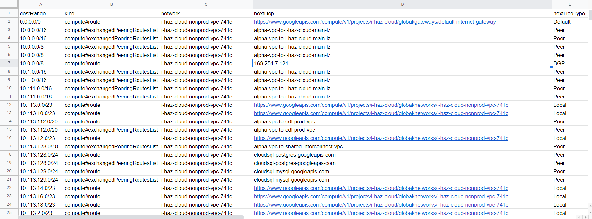

**More Information Coming Soon**

# gcloud Route Commands
## Generate VPC Route List
```bash
gcloud compute routes list --project my-project name --filter=network="https://www.googleapis.com/compute/v1/projects/my-project-name/global/networks/my-vpc-name"
```

## Generate VPC Peer List
```bash
gcloud compute networks peerings list --project my-project-name --network my-vpc-name

# Repeate the following command for each peer output, example below replace my-vpc-peer-with-xyz with the name of a vpc peer
gcloud compute networks peerings list-routes my-vpc-peer-with-xyz --project my-project-name  --network my-vpc-name --direction INCOMING --region us-central1 --filter=status=accepted
```

## Generate BGP Route List
```bash
gcloud compute routers list --project my-project-name --regions us-central1 --filter=network="https://www.googleapis.com/compute/v1/projects/my-project-name/global/networks/my-vpc-name"

# Repeate the following command for each router output, example below replace my-vpc-router-alpha with the name of a router
gcloud compute routers get-status --project my-project-name --region us-central1 my-vpc-router-alpha

## From the above results you will want to focus on bestRoutes
```

# Single TF Command
```bash
terraform apply -auto-approve -var="project_id=my-project-name" -var="vpc_name=my-vpc-name" -var="region=us-central1"
terraform output -json route_table > route_table.json


## You can use a site like https://konklone.io/json/ to convert the json into a CSV for sorting and filtering
```
